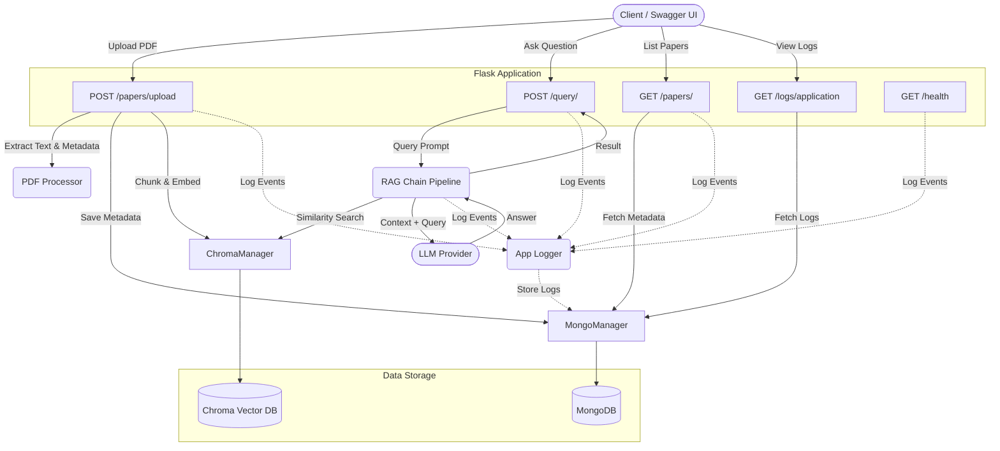

# System State: Academic Agent

This document outlines the current architectural state and data flow for the **Academic Agent** project, based on the codebase wiring.

## High-Level Architecture

The Academic Agent is a Flask-based application that uses Retrieval-Augmented Generation (RAG) to answer questions based on academic PDFs. 

### Core Components
- **Flask App & Flask-RESTX**: Exposes the REST API and provides Swagger documentation (`/swagger/`).
- **PDFProcessor (`app/utils/pdf_processor.py`)**: Handles extraction of text and metadata from uploaded PDF documents.
- **MongoManager (`app/database/mongo_client.py`)**: Manages connections to MongoDB for storing application logs and document metadata.
- **ChromaManager (`app/database/chroma_client.py`)**: Manages the ChromaDB vector database, which stores document chunks and embeddings.
- **RAGChain (`app/rag/chain.py`)**: Integrates LangChain, retrieving document chunks from ChromaDB and passing them to an LLM along with the `FINAL_ANSWER_PROMPT` to generate answers.
- **AppLogger (`app/utils/logging.py`)**: A centralized logging utility that writes standard file logs and structured MongoDB logs.

## Architecture Diagram (Mermaid)

## Data Flow Overview

1. **Document Upload (`/papers/upload`)**: A user uploads a PDF. The `PDFProcessor` parses the text. The parsed data is sent to `ChromaManager` to be chunked and stored as embeddings in ChromaDB, while the metadata and file reference are stored in MongoDB via `MongoManager`.
2. **Querying (`/query/`)**: A user submits a query. The `RAGChain` requests relevant chunks from `ChromaManager`. The retrieved context is passed alongside the `FINAL_ANSWER_PROMPT` to the LLM. 
3. **Observability**: `AppLogger` is injected throughout all components. Logs are saved both to a local file (`./logs/app.log`) and persisted into MongoDB for API access via `/logs/application`.

> **Note**: This is the general, high-level system state. If you need more detailed sub-system diagrams (e.g., breaking out the RAG pipeline chunking strategy or MongoDB schema), we can split this into multiple `SYSTEM_STATE` files per module.
